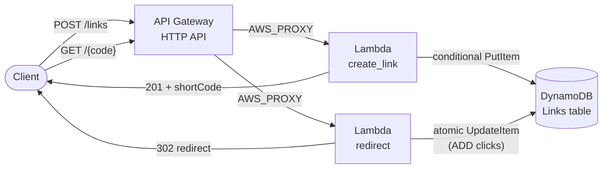
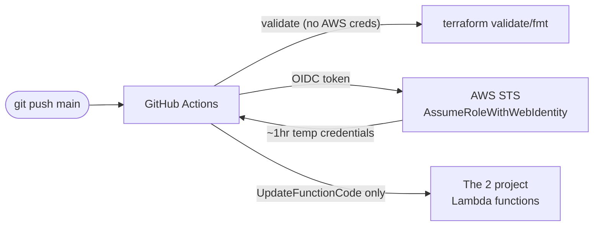

# Serverless URL Shortener


## Overview

URL shorteners are a small, well-understood problem — which is exactly
why this project uses one as the vehicle for something else: practicing
production-grade AWS infrastructure and deployment discipline on a scope
small enough to build, document, and fully understand end to end, rather
than a large feature set built shallowly.

The application itself: `POST` a long URL, get a short code back; `GET`
the short code, get redirected to the original URL, with an atomic click
counter. Public API, no authentication, no frontend hosting — that scope
was a deliberate choice, not a limitation of the tooling (see
[Future Improvements](#future-improvements) for what a production version
would add).

What this project is actually meant to demonstrate:
- Infrastructure provisioned **entirely from Terraform**, from an empty
  AWS account — no console-created or imported resources
- **Least-privilege IAM applied concretely**, twice, with different scope
  reasoning each time (a running function's data access vs. a CI
  pipeline's deploy access)
- **Keyless CI/CD** — GitHub Actions authenticated to AWS via OIDC
  federation, with zero long-lived credentials stored anywhere in GitHub
- Real debugging: a genuine OIDC trust-policy failure, root-caused by
  decoding the actual token rather than trusting documentation (see
  [Troubleshooting](#troubleshooting))

## Architecture

**Runtime — how a request is handled:**



**Deploy — how code reaches AWS with no stored credentials:**



Full diagrams, plus a step-by-step request/deploy walkthrough:
[`docs/architecture.md`](./docs/architecture.md)

## Technologies

- **AWS Lambda** (Python 3.13, arm64/Graviton2) — application logic
- **Amazon API Gateway** (HTTP API) — public HTTP entry point
- **Amazon DynamoDB** (on-demand) — data store
- **AWS IAM** — execution role + CI deploy role, both least-privilege
- **Amazon CloudWatch Logs** — execution logging, explicit retention
- **Terraform** — all infrastructure, written from scratch
- **GitHub Actions** — CI/CD pipeline
- **OpenID Connect (OIDC)** — federated, keyless authentication between
  GitHub Actions and AWS

No containers, orchestration, or service mesh — deliberately out of
scope for a two-route serverless app; see
[Future Improvements](#future-improvements) for where those *would* make
sense at a different scale.

## Architecture Explanation

| Component | What it does | Why it exists |
|---|---|---|
| **API Gateway (HTTP API)** | Public HTTPS endpoint; routes `POST /links` and `GET /{code}` to the right Lambda via `AWS_PROXY` integration | HTTP API over REST API — ~70% cheaper, lower latency, no transformation/authorizer complexity this app doesn't need |
| **Lambda: `create_link`** | Parses the request body, validates the submitted URL, generates a random short code, writes it to DynamoDB with a collision guard | Serverless compute for a low/bursty write path — no server to provision or idle |
| **Lambda: `redirect`** | Looks up a short code and, in one atomic DynamoDB call, increments its click counter and returns the target URL; 404 on an unknown code | Split from `create_link` since reads vastly outnumber writes — independent scaling and blast radius |
| **DynamoDB `Links` table** | Stores `{shortCode, longUrl, clicks, createdAt}`, partition key `shortCode` | Single point-lookup access pattern; on-demand billing fits unpredictable lab traffic with no capacity planning |
| **IAM: Lambda execution role** | What the running functions may do | One shared role, scoped to exactly `PutItem`/`GetItem`/`UpdateItem` on the one table — nothing else |
| **IAM: GitHub Actions deploy role** | What the CI pipeline may do | Scoped to exactly `lambda:UpdateFunctionCode` on exactly the two project function ARNs — no invoke, no config changes, no other AWS service |
| **CloudWatch Log Groups** | Captures each Lambda's execution logs | Explicit 14-day retention — avoids the default *never-expire* auto-created log group |
| **GitHub Actions (`deploy.yml`)** | `validate` (Terraform syntax/format, no AWS creds) then `deploy` (OIDC-assumed creds, push-to-`main`-only) | Two-job split keeps PR feedback credential-free and gates deploys to reviewed, merged code |

## Repository Structure

```
terraform/    # All infrastructure — provider, DynamoDB, IAM, Lambda,
              # API Gateway, OIDC trust + CI role, outputs
src/
  create_link/app.py   # POST /links handler
  redirect/app.py      # GET /{code} handler
.github/workflows/
  deploy.yml    # validate (no creds) + deploy (OIDC-assumed) jobs
docs/
  architecture.md            # Big-picture diagrams + walkthroughs
  phase-1-infrastructure.md  # Full Terraform build log
  phase-2-application-code.md # Full application code build log
  phase-3-cicd.md            # Full CI/CD build log
  troubleshooting.md         # Every real issue hit, root cause, fix
  concepts-glossary.md       # Every concept covered, one reference
  interview-prep.md          # Q&A grounded in this project
```

## Prerequisites

To deploy this yourself:

- An AWS account, with credentials configured locally (`aws sts
  get-caller-identity` should succeed) and sufficient permissions to
  create DynamoDB tables, IAM roles/policies, Lambda functions, API
  Gateway APIs, and CloudWatch log groups
- [Terraform](https://developer.hashicorp.com/terraform/install) >= 1.6.0 (built and tested on 1.16.3)
- Python 3.13 (only needed for local testing of the handler logic — not
  required at runtime, since Lambda provides its own execution
  environment)
- [GitHub CLI](https://cli.github.com/) (`gh`) — optional, only needed if
  setting up the CI/CD pipeline against your own fork

## Deployment

**1. Provision the infrastructure:**
```bash
cd terraform
terraform init
terraform plan      # review before applying
terraform apply
```

**2. Get the live API endpoint:**
```bash
terraform output api_endpoint
```

**3. Test it:**
```bash
curl -s -X POST "$(terraform output -raw api_endpoint)/links" \
  -H "Content-Type: application/json" \
  -d '{"url": "https://example.com"}'
# → {"shortCode": "...", "longUrl": "https://example.com", "createdAt": ...}

curl -iL "$(terraform output -raw api_endpoint)/<shortCode-from-above>"
```

Application code changes (`src/*/app.py`) redeploy the same way — edit,
then `terraform apply` again — or automatically via the CI/CD pipeline
below, once it's set up.

Full step-by-step build log, with every command and its actual output:
[`docs/phase-1-infrastructure.md`](./docs/phase-1-infrastructure.md),
[`docs/phase-2-application-code.md`](./docs/phase-2-application-code.md)

## CI/CD

`.github/workflows/deploy.yml` runs two jobs on every push/PR to `main`:

- **`validate`** — `terraform init -backend=false`, `terraform validate`,
  `terraform fmt -check` — genuinely credential-free, so it runs safely
  on any PR, including from a fork
- **`deploy`** — gated to `if: github.ref == 'refs/heads/main' &&
  github.event_name == 'push'` and `needs: validate`. Requests a
  short-lived OIDC token from GitHub, exchanges it for temporary AWS
  credentials via `sts:AssumeRoleWithWebIdentity`, then runs `aws lambda
  update-function-code` for both functions.

No AWS access keys exist in GitHub at any point — Secrets settings for
this repo are empty by design.

Setting this up in your own fork requires: an IAM OIDC identity provider
for `token.actions.githubusercontent.com` in your AWS account (one per
account — Terraform looks this up via a data source rather than creating
it, since most accounts already have one from any prior GitHub
Actions+AWS project), plus updating the `sub` condition and role ARN in
`terraform/github-actions.tf` and `deploy.yml` to match your repo.

Full build log, including a real debugging investigation into the
trust-policy configuration:
[`docs/phase-3-cicd.md`](./docs/phase-3-cicd.md)

## Security

- **No long-lived AWS credentials anywhere** — CI authenticates via OIDC
  federation (short-lived, per-run STS credentials, ~1hr expiry), not
  stored access keys.
- **Least privilege, applied at two different layers:**
  - The Lambda execution role: exactly `PutItem`/`GetItem`/`UpdateItem`
    on one DynamoDB table ARN — not `AmazonDynamoDBFullAccess`.
  - The CI deploy role: exactly `lambda:UpdateFunctionCode` on exactly
    two function ARNs — not `InvokeFunction`, not config changes, no
    wildcard resource. A fully compromised CI run can only ever push code
    to these two functions.
- **OIDC trust policy scoped to one repo, one branch** — the `sub`
  condition matches this exact repository and `main` branch (using
  GitHub's ID-qualified claim format, which survives a repo/username
  rename — see `docs/troubleshooting.md` #1). Combined with an `aud`
  condition confirming the token was issued specifically for AWS STS.
- **Resource-based Lambda permissions** — API Gateway's ability to invoke
  each function is a separate, explicit grant (`aws_lambda_permission`)
  scoped via `source_arn` to this API only.
- **Input validation against malicious redirects** — submitted URLs must
  use `http`/`https` and include a real host; `javascript:`, `file:`, and
  similar schemes are rejected, since accepted URLs are placed directly
  into a `Location` header sent to a browser.
- **Known, accepted gap:** the API is intentionally public with no
  authentication — a deliberate scope decision for this lab (see
  [Future Improvements](#future-improvements)), not an oversight.

## Monitoring

- Each Lambda has its own CloudWatch Log Group with **explicit 14-day
  retention** — set deliberately, since an unconfigured Lambda log group
  defaults to *never expiring*.
- Application code uses Python's `logging` module (not bare `print()`)
  for leveled, filterable log output — `INFO` for normal operations,
  `WARNING` for handled edge cases (short-code collisions),
  `logger.exception` for unhandled errors (full detail logged, only a
  generic message returned to the client).
- **Not yet built:** a CloudWatch alarm on Lambda errors wired to SNS —
  scoped as an explicit stretch goal from the start and intentionally
  deferred; see [Future Improvements](#future-improvements).

## Troubleshooting

Every real issue hit during this build — symptom, actual diagnostic
steps taken, root cause, and fix — is logged in full in
[`docs/troubleshooting.md`](./docs/troubleshooting.md). Highlights:

- **OIDC `AssumeRoleWithWebIdentity` — "Not authorized"**: two failed
  deploys with an apparently-correct trust policy led to decoding the
  actual GitHub-issued JWT, which revealed GitHub's real `sub` claim is
  ID-qualified (`repo:owner@ownerId/repo@repoId:...`), not the plain-name
  format initially assumed.
- **Phantom Lambda redeploy**: `terraform plan` showed a `source_code_hash`
  change with no code edits — traced to `archive_file` zipping a stray
  `__pycache__` directory, since Terraform's file-packaging has no concept
  of `.gitignore`.
- Four smaller issues (tooling assumptions, terminal artifacts, a stale
  local test file) are also documented for completeness.

## Testing

- **Unit-level**: pure helper functions (`validate_url`,
  `generate_short_code`) tested locally via ad hoc `python3 -c` scripts
  before ever being wired into a deployed Lambda — no AWS calls needed to
  verify URL-validation edge cases (missing scheme, disallowed scheme,
  missing host, over-length input).
- **Integration**: every phase was verified against the *live* AWS API
  directly — `describe-table`, `get-role`/`get-role-policy`, `lambda
  invoke`, `describe-log-groups`, and curl against the real HTTP API —
  not just Terraform's own plan output.
- **End-to-end**: the full create → redirect → click-increment flow was
  tested in one sequence (not just piecemeal per-function), and the CI/CD
  pipeline was validated by pushing a real, functional code change
  (adding a `createdAt` field to the API response) and confirming it
  changed the live API's behavior automatically.
- **Known gap**: no automated test suite (e.g. `pytest` + `moto` for
  mocked AWS calls) runs in CI — all testing so far has been manual/ad
  hoc. See [Future Improvements](#future-improvements).

## Cost Considerations

Every resource here is either free-tier eligible or billed per-request,
with no idle/always-on cost:

| Resource | Cost driver | Notes |
|---|---|---|
| Lambda | Per invocation + duration | Generous free tier (1M requests/month); arm64 is ~20% cheaper than x86 |
| API Gateway (HTTP API) | Per request | Cheaper than REST API by design; free tier covers 1M requests/month for 12 months |
| DynamoDB | Per request (on-demand) | No idle cost — pay only for actual reads/writes; free tier covers light use |
| CloudWatch Logs | Ingestion + storage | Minimal at this traffic volume; 14-day retention bounds storage growth |

No NAT gateways, load balancers, or always-on compute (EC2/RDS/ECS) are
used — those are the usual sources of surprise AWS bills, and this
architecture avoids them entirely by design. Realistic cost for this
project at lab-level traffic: effectively **$0/month**, within free-tier
limits.

## Lessons Learned

- Building Terraform from scratch (not importing console-created
  resources) forces understanding *why* each argument exists, not just
  copying a working example.
- `archive_file` and other filesystem-reading Terraform data sources have
  no concept of `.gitignore` — git and Terraform have entirely separate
  views of "what's in this directory."
- Local Terraform state has a real, specific consequence for CI/CD: with
  no remote backend, CI has no way to read `terraform output`, so
  resource identifiers had to be hardcoded in the workflow rather than
  looked up dynamically — a concrete trade-off, not just a theoretical one.
- Debugging a federated-identity (OIDC/JWT) failure is far faster by
  decoding the actual token than by trusting documentation or memory —
  JWTs are base64, not encrypted, and are directly inspectable.
- Least privilege isn't a one-time setting — it required actively
  narrowing scope at two separate points (the execution role and the CI
  role), each with different reasoning about who the "actor" is and what
  a compromise of that actor should and shouldn't be able to do.

## Future Improvements

What a production version of this would add, roughly in priority order:

- **Automated tests in CI** — `pytest` unit tests for the validation/code
  generation logic, plus `moto`-mocked integration tests, run as a job in
  `deploy.yml` before deploy.
- **Remote Terraform state** (S3 + a DynamoDB lock table) — enables safe
  multi-person/CI use, and lets CI read `terraform output` directly
  instead of hardcoded resource identifiers.
- **Rate limiting** — an API Gateway usage plan + API key (lighter-weight
  than full authentication) to prevent abuse of the public endpoint.
- **DynamoDB TTL** — auto-expire old links via an `expiresAt` attribute,
  rather than links living forever.
- **One CloudWatch alarm** on Lambda errors, wired to SNS — basic
  operational alerting, deliberately deferred as a stretch goal.
- **A gated, manual infrastructure-change pipeline** — a separate
  `workflow_dispatch`-triggered workflow (not auto-run on push) for
  `terraform apply`/`destroy`, with its own broader IAM role and required
  approval — kept separate from the narrowly-scoped automatic code-deploy
  pipeline.
- **A minimal frontend** — a static HTML form (synced to S3) so links can
  be created without curl/Postman.
- **WAF** in front of the API Gateway, for basic abuse/bot protection on
  a public, unauthenticated endpoint.

## Cleanup

To tear down every AWS resource this project created and stop any
further cost:

```bash
cd terraform
terraform destroy
```

Review the destroy plan before confirming — this deletes the DynamoDB
table (**and all stored links/click data**), both Lambda functions, the
API Gateway API, both IAM roles/policies, and both CloudWatch log groups.

**Not affected:** the GitHub Actions OIDC identity provider
(`token.actions.githubusercontent.com`) is referenced via a Terraform
*data source*, not created by this project — `terraform destroy` will
not remove it, which is correct, since it may be shared with other
projects in the same AWS account.

The GitHub repository itself has no ongoing AWS cost and can be kept
indefinitely; delete it separately if desired with `gh repo delete
<owner>/<repo>`.
