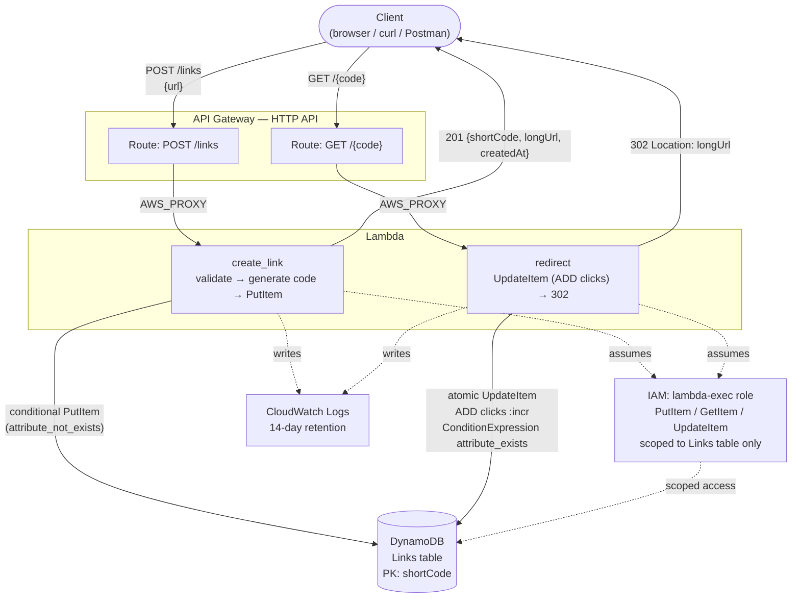
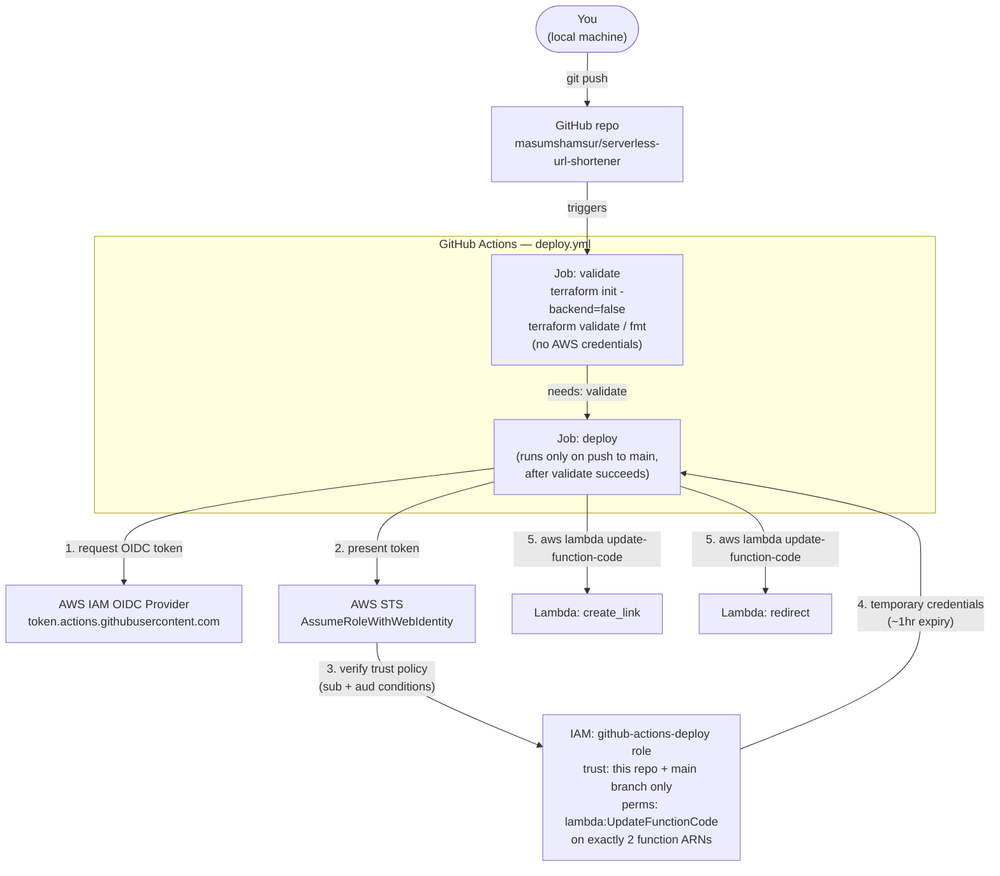

# Architecture — End-to-End Summary

## Objective

Given a long URL, return a short code; given a short code, redirect to the
original URL and count the click. Public API, no auth, no frontend hosting
— deliberately minimal, built to understand how a small set of serverless
AWS primitives compose into a working system, not to be a production
product.

## The resources, and why each one exists

| Resource | Purpose | Why this one, not an alternative |
|---|---|---|
| **API Gateway (HTTP API)** | Public HTTP entry point; routes requests to the right Lambda | HTTP API over REST API — leaner, ~70% cheaper, no transformation/authorizer needs here ([`phase-1-infrastructure.md`](./phase-1-infrastructure.md) Step 5) |
| **Lambda: `create_link`** | Validates a submitted URL, generates a short code, writes to DynamoDB | Serverless — no server to run for a low/bursty-traffic write path |
| **Lambda: `redirect`** | Looks up a code, atomically increments its click count, returns a 302 | Split from `create_link` for independent scaling/blast-radius, since reads vastly outnumber writes |
| **DynamoDB (`Links` table)** | Stores `{shortCode, longUrl, clicks, createdAt}` | Single point-lookup access pattern, no relational structure needed; on-demand billing fits unpredictable traffic ([`phase-1-infrastructure.md`](./phase-1-infrastructure.md) Step 2) |
| **IAM: Lambda execution role** | What the running functions are allowed to do | One shared role, scoped to exactly `PutItem`/`GetItem`/`UpdateItem` on the one table — least privilege ([`phase-1-infrastructure.md`](./phase-1-infrastructure.md) Step 3) |
| **CloudWatch Log Groups** | Captures Lambda execution logs | Explicit 14-day retention set per function, to avoid the default never-expire auto-created group |
| **GitHub Actions + OIDC** | Deploys Lambda code on push to `main` | No long-lived AWS keys stored anywhere in GitHub ([`phase-3-cicd.md`](./phase-3-cicd.md)) |

## Runtime architecture — how a request actually flows

**Request walkthrough — creating a link:**
1. Client sends `POST /links` with `{"url": "..."}` as the body.
2. API Gateway matches the `POST /links` route, invokes `create_link` via `AWS_PROXY` — the entire HTTP request lands as one JSON event.
3. `create_link` parses `event["body"]`, validates the URL (`validate_url`), generates a random 7-char code (`generate_short_code`), and writes it to DynamoDB with `ConditionExpression="attribute_not_exists(shortCode)"` — retrying with a new code on the rare collision.
4. Returns `201` with `{shortCode, longUrl, createdAt}`.

**Request walkthrough — following a short link:**
1. Client sends `GET /{code}`.
2. API Gateway matches `GET /{code}`, invokes `redirect` with `event["pathParameters"]["code"]` set.
3. `redirect` runs a single `UpdateItem` that both increments `clicks` (`ADD clicks :incr`) and returns the full item (`ReturnValues="ALL_NEW"`) — one DynamoDB call for both the write and the read. `ConditionExpression="attribute_exists(shortCode)"` turns an unknown code into a clean 404 instead of silently creating garbage data.
4. Returns `302` with `Location: <longUrl>`; the client follows it.

Both Lambdas share one IAM execution role (Step 3 of Phase 1) — narrowly scoped to exactly the three DynamoDB actions they need, on exactly this one table.

## Deploy architecture — how code gets from your laptop to AWS

**Deploy walkthrough:**
1. You push to `main`.
2. `validate` runs first — pure Terraform syntax/format checks, zero AWS credentials involved.
3. `deploy` runs only if `validate` passed and the push was to `main`. It requests a short-lived OIDC token from GitHub, presents it to AWS STS, which checks it against `github-actions-deploy`'s trust policy (matching the token's `sub` claim to this exact repo+branch, ID-qualified — see [`troubleshooting.md`](./troubleshooting.md) #1 for why that matters) and `aud` claim.
4. STS returns temporary credentials (no long-lived keys ever stored in GitHub), scoped to exactly one permission: `lambda:UpdateFunctionCode` on exactly the two project functions.
5. The job zips each function's source and calls `aws lambda update-function-code` directly — no `terraform apply` in this path (see [`phase-3-cicd.md`](./phase-3-cicd.md) Step 4 for why: local Terraform state means CI has no state to read outputs from, and infra changes are a deliberate manual step, not something CI is trusted to do).

## Where to go for more detail

- **Step-by-step build logs, with commands and results:** [`phase-1-infrastructure.md`](./phase-1-infrastructure.md), [`phase-2-application-code.md`](./phase-2-application-code.md), [`phase-3-cicd.md`](./phase-3-cicd.md)
- **Every new concept explained:** [`concepts-glossary.md`](./concepts-glossary.md)
- **Real issues hit and how they were fixed:** [`troubleshooting.md`](./troubleshooting.md)
- **Interview Q&A grounded in this project:** [`interview-prep.md`](./interview-prep.md)
